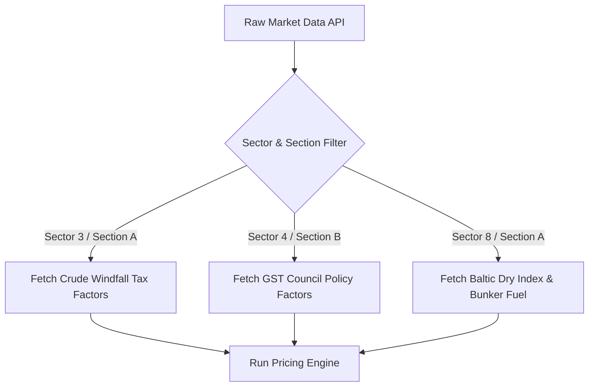

# Indian Market Sector & Sub-Sector (Section) Bifurcation Map

This document defines the thematic classification system for the **ALTAIR** quantitative and high-frequency trading database configurations. It maps 10 parent sectors into granular sub-sector sections, defining the precise macroeconomic drivers the algorithm tracks for each segment.

> [!NOTE]
> In the database schema, each target stock must be mapped with a corresponding `SectorID` (1 to 10) and `SectionID` (A, B, or C). This enables the backend algorithm to dynamically query sector-specific pricing models and risk parameters.

---

## 🗂️ Thematic Classification Structure

### 1. BFSI (Banking & Financial Services)
*   **Section A: Private Sector Banks**
    *   *Focus:* Retail credit expansion, corporate loan books, fee income.
    *   *Key Algorithmic Drivers:* Credit Growth, Net Interest Margins (NIMs), Cost-to-Income ratios.
*   **Section B: Public Sector Banks (PSUs)**
    *   *Focus:* Infrastructure lending, corporate credit, treasury yields.
    *   *Key Algorithmic Drivers:* G-Sec Yields (Treasury gains), Gross NPA percentage, credit-to-deposit ratio.
*   **Section C: NBFCs & Retail Lenders**
    *   *Focus:* Gold finance, housing finance, vehicle and micro-finance.
    *   *Key Algorithmic Drivers:* Cost of wholesale funding, liquidity spreads, RBI repo rate cycles.

### 2. IT & Technology
*   **Section A: Large-Cap IT Services**
    *   *Focus:* Global enterprise digital outsourcing, multi-year deal values.
    *   *Key Algorithmic Drivers:* USD/INR rate, US Federal Reserve interest rates, US Tech sector capital expenditure.
*   **Section B: Mid-Cap/SaaS/New-Age Tech**
    *   *Focus:* High-beta growth, domestic digital services, consumer tech platforms.
    *   *Key Algorithmic Drivers:* Domestic venture capital flows, consumer transaction volumes, platform daily active users (DAUs).

### 3. Energy & Utilities
*   **Section A: Upstream Oil & Gas**
    *   *Focus:* Oil exploration, drilling, gas production.
    *   *Key Algorithmic Drivers:* Brent Crude index, WTI Crude spot price, government windfall tax rates.
*   **Section B: Downstream Refiners & OMCs**
    *   *Focus:* Fuel refining, distribution, marketing, and retail.
    *   *Key Algorithmic Drivers:* Gross Refining Margins (GRMs), marketing margins, domestic oil price regulations.
*   **Section C: Power Generation & Green Utilities**
    *   *Focus:* Renewable power plants, thermal power, transmission grids.
    *   *Key Algorithmic Drivers:* Power Purchase Agreements (PPAs), peak daily load data, domestic coal cost trends.

### 4. Consumer Goods
*   **Section A: Standard FMCG**
    *   *Focus:* Household personal care, food products, agricultural commodities.
    *   *Key Algorithmic Drivers:* Rural wage growth index, Monsoon deficiency metrics, Palm oil / Wheat commodity prices.
*   **Section B: Sin Goods (Tobacco & Alcohol)**
    *   *Focus:* Highly cash-generative, price-inelastic regulated consumer habits.
    *   *Key Algorithmic Drivers:* GST Council policy announcements, State-wise excise duty revisions, Union Budget taxation.

### 5. Industrials & Defense
*   **Section A: Defense Production**
    *   *Focus:* Aerospace systems, defense electronics, naval shipbuilding, missiles.
    *   *Key Algorithmic Drivers:* Ministry of Defense order pipeline, export orders, defense capital expenditure budget.
*   **Section B: Capital Goods & Heavy Engineering**
    *   *Focus:* Capex machinery, manufacturing equipment, electrical gear.
    *   *Key Algorithmic Drivers:* Private sector capacity utilization, public infrastructure capex spending, global steel prices.

### 6. Automobiles
*   **Section A: Passenger Vehicles & 2-Wheelers**
    *   *Focus:* Consumer mobility, passenger cars, utility vehicles.
    *   *Key Algorithmic Drivers:* Vehicle retail financing rates, rural harvest income cycle, steel/rubber commodity index.
*   **Section B: Commercial Vehicles & Ancillaries**
    *   *Focus:* Heavy trucks, auto components, components exports.
    *   *Key Algorithmic Drivers:* Zonal freight movement volume, Index of Industrial Production (IIP).

### 7. Commodities & Metals
*   **Section A: Ferrous Metals (Steel)**
    *   *Focus:* Construction steel, alloy production.
    *   *Key Algorithmic Drivers:* Iron ore spot prices, coking coal costs, China infrastructure demand indexes.
*   **Section B: Non-Ferrous Metals (Aluminium, Copper)**
    *   *Focus:* Industrial components, electrical wiring, EV grids.
    *   *Key Algorithmic Drivers:* London Metal Exchange (LME) spot prices, global industrial inventory levels.

### 8. Logistics & Shipping
*   **Section A: Ports & Shipping**
    *   *Focus:* Port operations, cargo shipping, vessel chartering.
    *   *Key Algorithmic Drivers:* Baltic Dry Index (BDI), bunker fuel prices, EXIM trade volumes.
*   **Section B: Express Logistics & Supply Chain**
    *   *Focus:* Road transport cargo, logistics parks, warehousing.
    *   *Key Algorithmic Drivers:* Domestic diesel rates, e-commerce volume indicators.

### 9. Pharmaceuticals & Healthcare
*   **Section A: Export Formulations & API**
    *   *Focus:* Generic drug export, active pharmaceutical ingredients.
    *   *Key Algorithmic Drivers:* US FDA inspection results, US generic drug price erosion index.
*   **Section B: Domestic Formulations & Hospitals**
    *   *Focus:* Private hospital chains, domestic therapy sales.
    *   *Key Algorithmic Drivers:* Bed occupancy rates, average revenue per occupied bed (ARPOB), insurance density.

### 10. Special High-Sensitivity Segments
*   **Section A: Real Estate (Realty)**
    *   *Focus:* Residential real estate development.
    *   *Key Algorithmic Drivers:* Home loan rates, regional inventory inventory liquidation speed.
*   **Section B: Non-Bank PSUs**
    *   *Focus:* Railways, public mineral giants, public infra financing agencies.
    *   *Key Algorithmic Drivers:* Disinvestment targets, PSU dividend policy updates.

---

## 🛠️ Quant Logic Integration Schema

When developing the backend data collection pipeline, apply the following mapping rules:

> [!TIP]
> Use this structured mapping to clean up input datasets before training pricing prediction models in the sandbox.
