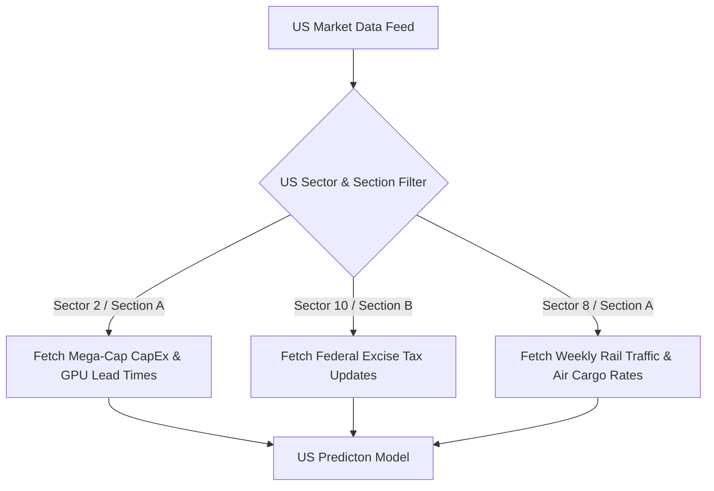

# US Market Sector & Sub-Sector (Section) Bifurcation Map

This document defines the thematic classification system for the **ALTAIR** quantitative and high-frequency trading database configurations adjusted for the **United States (US) Market**. 

> [!NOTE]
> In the US market context, the algorithm is heavily tied to macro benchmarks: the **US Fed Funds Rate**, the **US Dollar Index (DXY)**, the **US 10-Year Treasury Yield**, and **Nasdaq 100 / S&P 500 momentum**. Each US equity must be mapped with a corresponding `SectorID` and `SectionID`.

---

## 🗂️ Thematic Classification Structure (US Market)

### 1. Financials (S&P 500 Financials)
*   **Section A: Commercial & Retail Banking**
    *   *Focus:* Retail lending, mortgages, commercial credit deposits.
    *   *Key Algorithmic Drivers:* Net Interest Margin (NIM), 10Y-2Y Treasury Yield Curve spread, Fed Funds Rate.
*   **Section B: Investment Banking & Global Asset Managers**
    *   *Focus:* Mergers & Acquisitions (M&A) advisory, stock/bond issuance underwriting, assets under management (AUM).
    *   *Key Algorithmic Drivers:* Global IPO pipeline activity, market volatility index (VIX), corporate bond spreads.
*   **Section C: Fintech, Payment Gateways & Consumer Debt**
    *   *Focus:* Credit card transaction volumes, point-of-sale financing.
    *   *Key Algorithmic Drivers:* Personal Savings Rate, monthly retail sales data, delinquency rates on consumer credit.

### 2. Technology (Nasdaq / S&P Tech)
*   **Section A: Mega-Cap Tech & AI Infrastructure**
    *   *Focus:* Cloud computing, AI processors, hyper-scaler data center expansions.
    *   *Key Algorithmic Drivers:* Capital expenditure (CapEx) of top 5 tech companies, Nvidia GPU lead times, enterprise cloud adoption indexes.
*   **Section B: Semiconductors & Hardware Equipment**
    *   *Focus:* Chip designers, foundries, memory makers, hardware servers.
    *   *Key Algorithmic Drivers:* SOX (Philadelphia Semiconductor Index), global silicon wafer shipments, global supply chain bottlenecks.
*   **Section C: Software-as-a-Service (SaaS) & Enterprise Platforms**
    *   *Focus:* Business subscription software, cybersecurity, database architecture.
    *   *Key Algorithmic Drivers:* Corporate IT spending budgets, Net Retention Rate (NRR) benchmarks.

### 3. Healthcare
*   **Section A: Pharmaceuticals & Biotechnology**
    *   *Focus:* Therapeutic drugs, clinical pipelines, novel research (e.g., GLP-1 weight loss).
    *   *Key Algorithmic Drivers:* US FDA Phase III trial announcement calendars, patent expiry dates (patent cliffs).
*   **Section B: MedTech & Surgical Devices**
    *   *Focus:* Robotic surgical systems, elective joint replacements, high-end medical implants.
    *   *Key Algorithmic Drivers:* US hospital staffing levels, elective surgery volume indicators.
*   **Section C: Health Insurance & Managed Care**
    *   *Focus:* Medicare/Medicaid programs, employer-sponsored plans.
    *   *Key Algorithmic Drivers:* Medical Loss Ratio (MLR), federal Medicare reimbursement policy changes.

### 4. Energy (US Oil & Gas)
*   **Section A: Upstream E&P (Exploration & Production)**
    *   *Focus:* Shale oil extraction (Permian, Bakken), natural gas drilling.
    *   *Key Algorithmic Drivers:* WTI Crude spot price, Henry Hub Natural Gas spot price, active US rig counts (Baker Hughes data).
*   **Section B: Downstream Refiners & Supermajors**
    *   *Focus:* Integrated global oil production, refining margins.
    *   *Key Algorithmic Drivers:* US Gulf Coast Crack Spreads, international crude flows, refinery utilization rates.
*   **Section C: Clean Energy, Solar & Storage**
    *   *Focus:* Residential solar, utility-scale wind, lithium battery packs.
    *   *Key Algorithmic Drivers:* Inflation Reduction Act (IRA) tax credit policy changes, commercial loan interest rates.

### 5. Consumer Discretionary
*   **Section A: E-Commerce & Retail Giants**
    *   *Focus:* Mega-scale logistics retail, online marketplaces.
    *   *Key Algorithmic Drivers:* Consumer Price Index (CPI), Consumer Confidence Index, shipping freight costs.
*   **Section B: Electric Vehicles (EV) & Legacy Auto**
    *   *Focus:* Electric vehicle production, hybrid fleet sales.
    *   *Key Algorithmic Drivers:* Lithium/cobalt spot prices, auto financing interest rates, battery factory capacity.
*   **Section C: Leisure, Lodging & Travel**
    *   *Focus:* Theme parks, cruise lines, luxury hotels.
    *   *Key Algorithmic Drivers:* US personal savings depletion rate, international flight booking volumes.

### 6. Defense & Aerospace
*   **Section A: Prime Defense Contractors**
    *   *Focus:* Fighter jets, missile defense systems, defense electronics.
    *   *Key Algorithmic Drivers:* US Congressional defense budget appropriations, geopolitical risk indexes, foreign military sales approvals.
*   **Section B: Commercial Aerospace**
    *   *Focus:* Commercial aircraft production, engines, airline component supply.
    *   *Key Algorithmic Drivers:* Airline capital expenditure cycles, global revenue passenger miles (RPM).

### 7. Communication Services
*   **Section A: Digital Advertising & Social Media Platforms**
    *   *Focus:* Programmatic ad bidding, search advertising.
    *   *Key Algorithmic Drivers:* Global marketing budget growth forecast, user engagement metrics (Daily Active Users).
*   **Section B: Telecom Carriers & Streaming Services**
    *   *Focus:* 5G infrastructure, content creation spend, subscriptions.
    *   *Key Algorithmic Drivers:* Monthly churn rate, capital expenditure on telecom towers, average revenue per user (ARPU).

### 8. Industrials & Transport Logistics
*   **Section A: Class-1 Freight Rail & Air Express**
    *   *Focus:* Intermodal freight rail, express package delivery (FedEx/UPS).
    *   *Key Algorithmic Drivers:* Association of American Railroads (AAR) weekly traffic data, global air cargo pricing.
*   **Section B: Industrial Conglomerates & Automation**
    *   *Focus:* Factory automation systems, aerospace components, HVAC manufacturing.
    *   *Key Algorithmic Drivers:* ISM Manufacturing PMI, new manufacturing orders index.

### 9. Utilities & Specialized Real Estate
*   **Section A: Regulated Electric & Gas Utilities**
    *   *Focus:* Regional power utilities, green utility grids.
    *   *Key Algorithmic Drivers:* US 10-Year Treasury Yield (acting as a yield spread proxy), electricity retail pricing caps.
*   **Section B: Technology REITs (Data Centers & Cell Towers)**
    *   *Focus:* Data center real estate leasing, telecom tower leases.
    *   *Key Algorithmic Drivers:* Fed Funds Rate (high capital debt exposure), cloud computing space leasing demand.

### 10. Consumer Staples & Sin Goods
*   **Section A: Household Products & Mega-Brand Beverages**
    *   *Focus:* Daily essentials, grocery packaging.
    *   *Key Algorithmic Drivers:* Input packaging costs (plastics, aluminum), grocery price inflation index.
*   **Section B: Sin Goods (Tobacco, Spirits & Cannabis)**
    *   *Focus:* Regulated adult consumption habits.
    *   *Key Algorithmic Drivers:* Federal/state excise taxation, FDA packaging regulations, state-by-state legalization cycles.

---

## 🛠️ US Quant Logic Integration Schema

When developing the US-specific data processing pipeline:

> [!TIP]
> US Tech Mega-Caps (Sector 2, Section A) are highly sensitive to bond yields. Ensure the algorithm automatically applies a **negative correlation coefficient** between S&P 500 Tech and the US 10-Year Treasury Yield during high-rate regimes.
